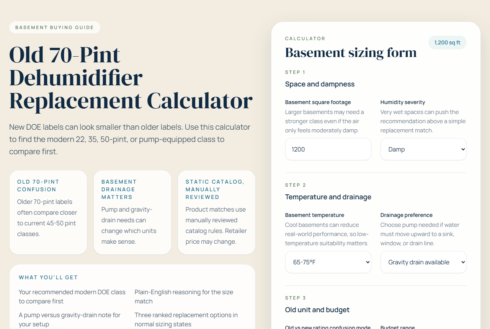

# Old 70-Pint Dehumidifier Replacement Calculator

Help homeowners replace older basement dehumidifiers — especially the iconic 70-pint models — with the right modern DOE-rated unit. The legacy pint scale and the post-2019 DOE label don't line up, so a "70-pint" replacement is rarely what people actually need.

**Live app:** https://calcmydehumidifier.com/




## What it does

- Asks for square footage, humidity severity, basement temperature, drainage preference, and budget.
- Maps the inputs to a modern DOE capacity tier (22 / 35 / 50-pint, or pump-equipped 50-pint).
- Explains *why* — the old vs new label gap, low-temperature derating, drainage needs.
- Recommends a small set of manually-curated products with affiliate links, and suppresses recommendations in out-of-bounds or "call a pro" scenarios.

Built by [Jacob Britten](https://jacobbritten.com).

## Tech stack

- React 18 + TypeScript + Vite
- Tailwind CSS
- Static catalog (no backend, no scraping)
- Deployed on Vercel with Web Analytics

## Local setup

```bash
npm install
npm run dev
```

## Build and scenario checks

```bash
npm run build
npm run check:scenarios
```

`check:scenarios` validates key recommendation outcomes and comparison-branch behavior.

## Analytics

Analytics is env-driven. The GA4 script is **not hardcoded** in `index.html` — it is injected at runtime by `initAnalytics()` (called in `main.tsx`) using `VITE_GA4_ID`. No script loads if the env var is absent.

Defaults:

- development: `console` (all events logged to console)
- production without `VITE_ANALYTICS_PROVIDER`: `none`

### Setting up GA4 on Vercel

Add these environment variables in your Vercel project settings (Settings → Environment Variables):

```
VITE_ANALYTICS_PROVIDER=ga4
VITE_GA4_ID=G-XXXXXXXXXX
```

After adding or changing env vars in Vercel, trigger a new production deployment.

### Setting up Plausible

```
VITE_ANALYTICS_PROVIDER=plausible
VITE_PLAUSIBLE_DOMAIN=calcmydehumidifier.com
```

Add the Plausible script tag to `index.html` manually when using Plausible (it is not injected automatically).

### Testing analytics locally

Set `VITE_ANALYTICS_PROVIDER=console` in `.env.local` and all events log to the browser console.

### Verifying GA4 after deploy

1. Open the live site in an incognito window.
2. Submit the calculator form.
3. Click any product CTA button.
4. Open GA4 → Realtime.
5. Look for `calculator_started`, `calculator_completed`, and `affiliate_card_clicked`.

### Tracked events

| Event | When |
|---|---|
| `calculator_started` | First field change, or first form submit if no field was changed |
| `calculator_completed` | Every form submit |
| `result_capacity_tier` | Every form submit (same timing as completed) |
| `affiliate_card_clicked` | Any product card CTA click |
| `affiliate_cta_clicked` | Any product card CTA click (same element, paired with above) |

Key parameters sent with `calculator_completed`:
`squareFootage`, `humiditySeverity`, `basementTemperature`, `drainagePreference`, `ratingConfusionMode`, `budgetRange`, `resultCapacityTier`, `confidenceLevel`, `fallbackStepsUsed`

## Product catalog policy

- Catalog is static and manually reviewed.
- Retailer pricing is not live and may change.
- Links may be exact model listings, retailer search listings, or category search listings.
- Comparison fallback logic can relax filters to keep options available and this is disclosed in the UI.
- The app does not scrape retailer prices.

## Quarterly manual review policy

- Review every catalog entry at least once per quarter.
- Confirm listing relevance, drainage claims, and low-temperature suitability notes.
- Update outdated links, remove stale entries, and refresh trust timestamps.

## Safety boundaries

This is a shopping guide, not a diagnostic system.

- No diagnosis of mold, leaks, HVAC, foundation, or structural issues.
- No remediation, legal, health, or performance guarantees.
- Flooded or out-of-range scenarios intentionally suppress product recommendations.

## Affiliate disclosure policy

- Affiliate disclosure appears near product comparisons in normal result states.
- Affiliate/product CTAs are hidden in professional-review or out-of-bounds states.
- Footer disclosure remains visible site-wide.

## Vercel deployment notes

This is a static frontend deployment.

- Build command: `npm run build`
- Output directory: `dist`
- No backend, auth, or database required
- Configure analytics via Vite env vars in Vercel project settings

## Project structure

```text
src/
  app/                App composition
  components/         Calculator/result/product/disclosure/content UI
  data/               Static catalog and sizing/content rules
  lib/                Recommendation, filtering, analytics, tracking helpers
  styles/             Global CSS
  types/              Shared TypeScript types
docs/                 Manual scenario matrix and project docs
scripts/              Scenario automation scripts
public/               Static assets
```
