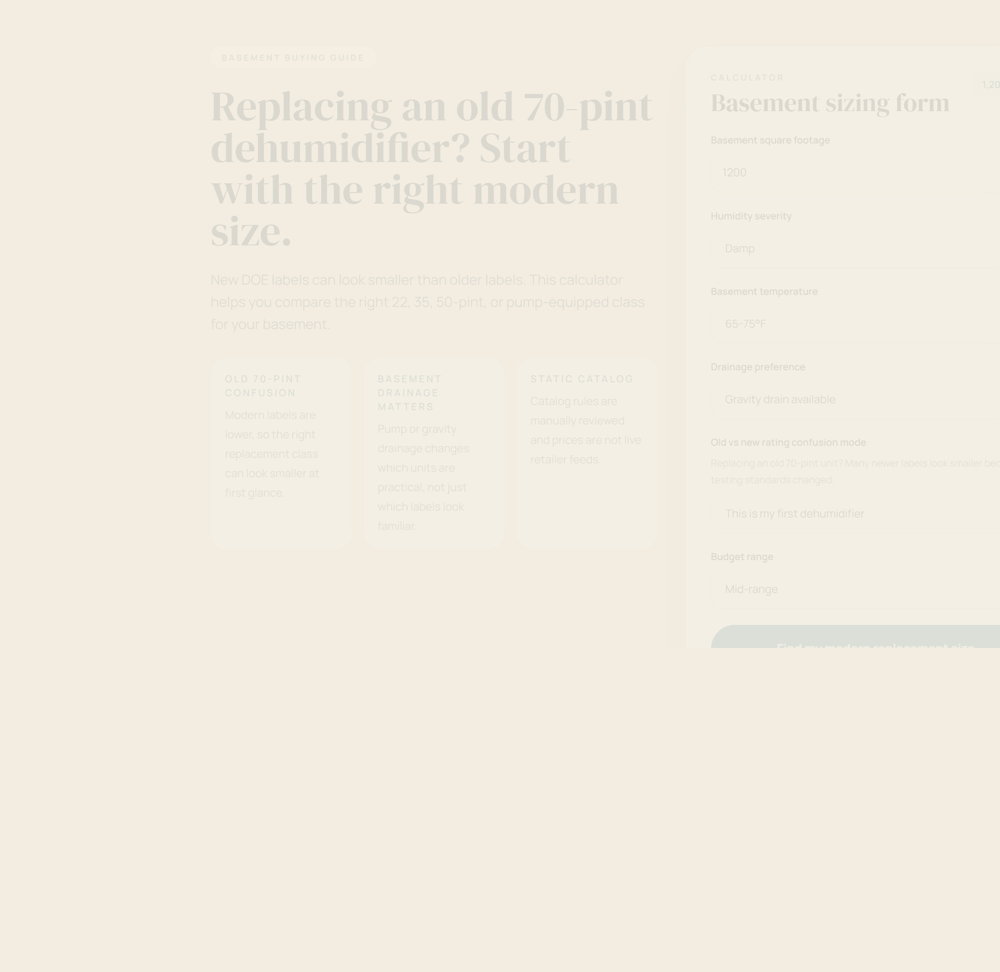

# Old vs New Dehumidifier Rating Calculator

A static Vite + React + TypeScript calculator for homeowners replacing older basement dehumidifiers and trying to understand modern DOE capacity labels.

The app focuses on one specific buying problem: an old 70-pint unit often does not map cleanly to newer labels, so shoppers need a plain-English recommendation for the right modern class before they compare products.

## Screenshot



## What it does

- Translates basement inputs into a modern dehumidifier size class.
- Helps users compare old 30, 50, and 70-pint labels against current DOE labels.
- Adjusts recommendations for moisture severity, drainage needs, basement temperature, and budget.
- Shows static product comparison cards only for normal in-bounds recommendation states.
- Stops product recommendations and switches to a professional-review panel for flooded or out-of-bounds scenarios.

## Guardrails

This project is a shopping guide, not a diagnostic tool.

- It does not diagnose mold, leaks, HVAC problems, foundation issues, structural problems, or health risks.
- It does not make remediation, legal, safety, or performance guarantees.
- Flooded basements and very large spaces intentionally suppress product recommendations and trigger a professional-review state.

## Tech stack

- Vite
- React 18
- TypeScript
- Tailwind CSS

## Local development

Install dependencies and start the dev server:

```bash
npm install
npm run dev
```

Build the production bundle:

```bash
npm run build
```

Preview the production build locally:

```bash
npm run preview
```

## Project structure

```text
src/
  app/                App shell and page composition
  components/         Calculator, result, product, and content UI
  data/               Static catalog and sizing/content rules
  lib/                Recommendation, filtering, formatting, analytics helpers
  styles/             Global CSS
  types/              Shared TypeScript types
docs/                 Manual test scenarios and content notes
public/               Static images and assets
```

## Recommendation behavior

Normal in-bounds results include:

- recommended modern size
- confidence badge
- explanation and reasoning
- drainage and temperature notes
- old-rating translation note
- product comparison cards

Professional-review results are triggered when:

- `status === "out_of_bounds"`
- or `confidenceLevel === "professional_review"`

In that state, the app does not show product cards, affiliate CTAs, or shopping language.

## Product catalog policy

- Product records are static and manually reviewed.
- Prices are not live.
- Retailer links are static search-style listings.
- The app does not scrape retailer prices.
- Comparison fallback logic may relax some filters to keep options available, but that is disclosed in the UI.

## Ratings change source context

The app references plain-English source context around why modern labels can appear smaller than older ratings.

Primary references used in the content:

- ENERGY STAR dehumidifier testing and capacity
- ENERGY STAR dehumidifier criteria
- EPA moisture guidance

The project does not claim endorsement from ENERGY STAR, EPA, or any government agency.

## Analytics configuration

Analytics settings are read from `window.__APP_ANALYTICS__` in `index.html`.

Example:

```html
<script>
  window.__APP_ANALYTICS__ = {
    provider: 'plausible',
    domain: 'example.com',
    debug: false,
  };
</script>
```

Supported providers:

- `console`
- `plausible`
- `ga4`
- `none`

Tracked events:

- `calculator_started`
- `calculator_completed`
- `result_capacity_tier`
- `affiliate_card_clicked`
- `affiliate_cta_clicked`

## Deployment

This is a static frontend app and can be deployed to Vercel, Netlify, or any static host.

- Build command: `npm run build`
- Output directory: `dist`
- No backend, database, or server routes required

## Manual testing

See `docs/test-scenarios.md` for expected calculator outcomes, including:

- flooded and out-of-bounds professional-review behavior
- old 70-pint replacement scenarios
- drainage-specific recommendation paths
- affiliate disclosure and product comparison visibility rules
